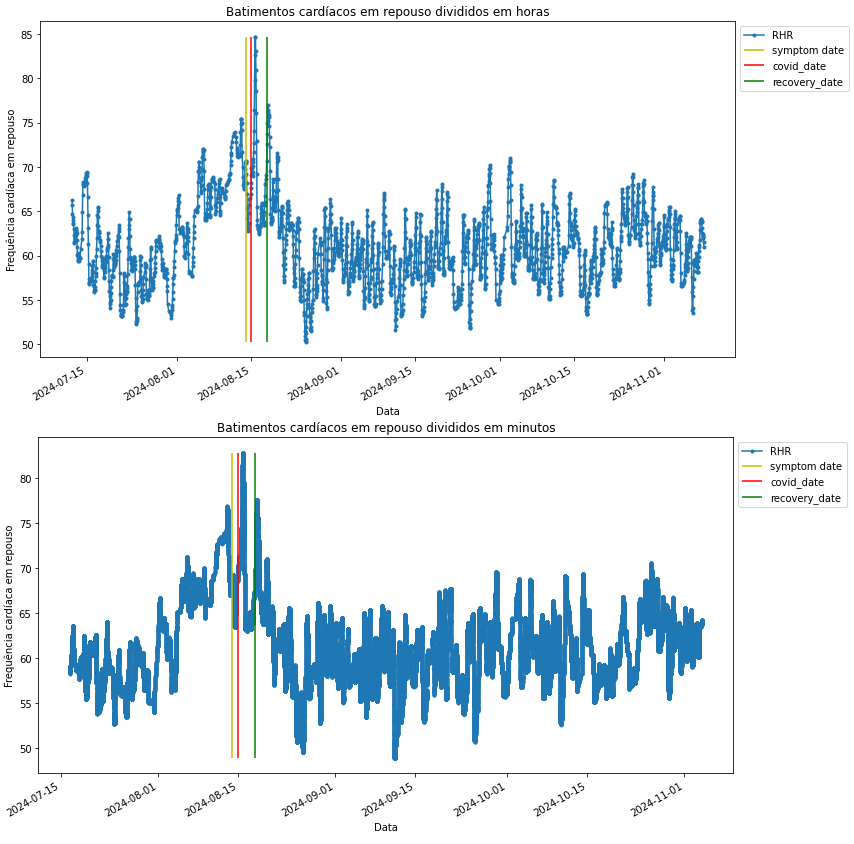
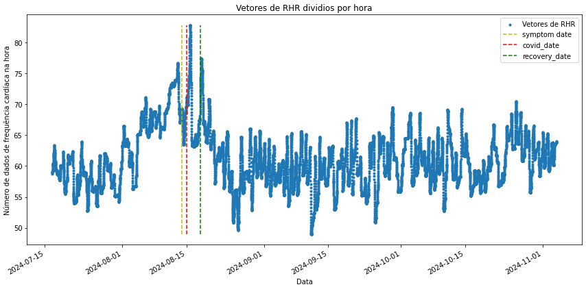
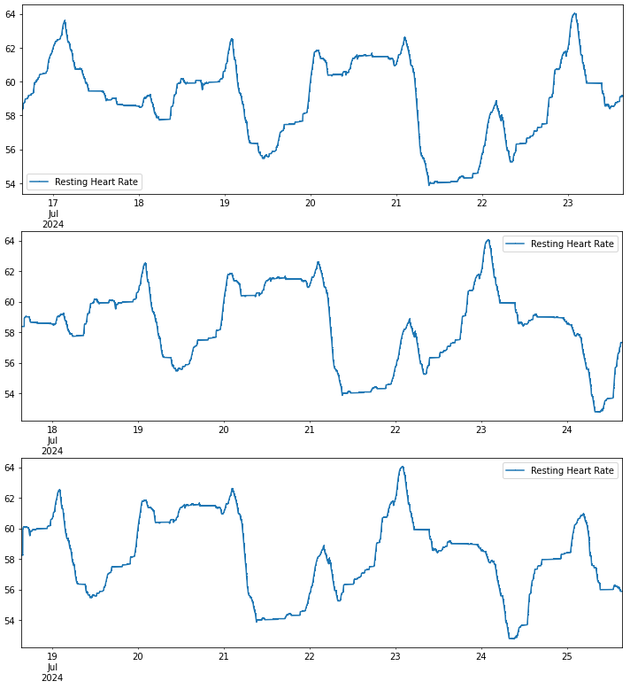
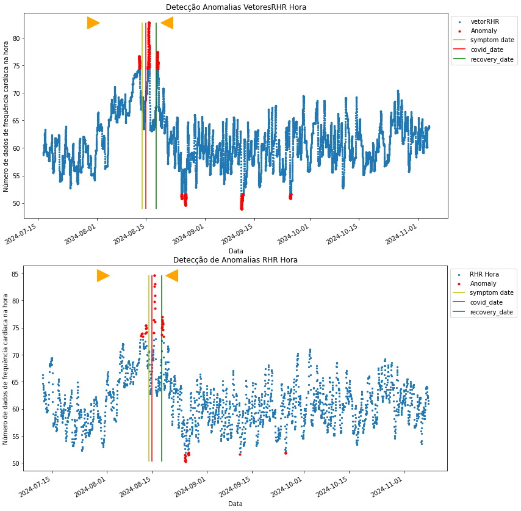
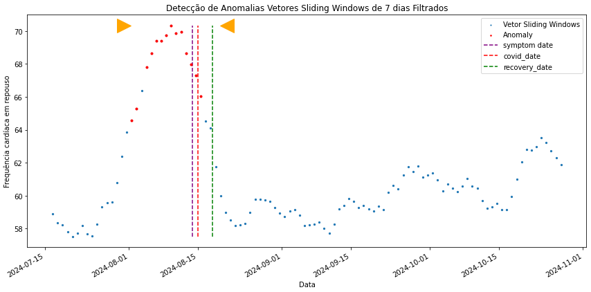
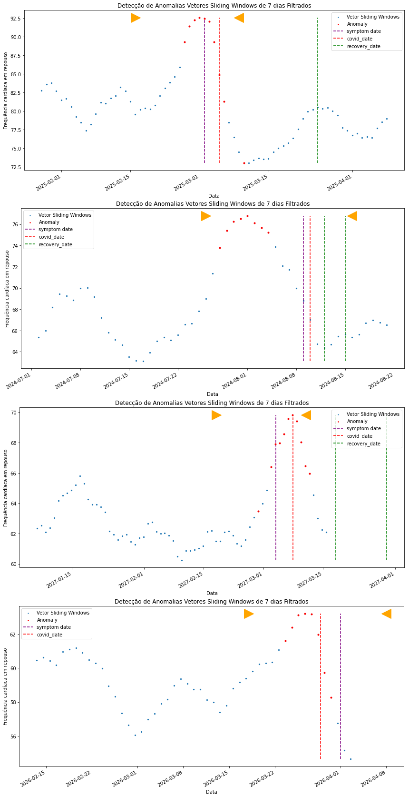

## The Execution:

First, we established the detection window through the analysis of the onset of symptoms and diagnostic date. This window was based on the incubation time of the COVID-19 virus. **Our goal is to observe if anomalies in the dataset are presented in the detection window (that suggests that anomalies detected can be used as indicative of diseases).**

The heart rate and step count were processed to calculate the resting heart rate (RHR), which involves standardized heartbeats per minute in regions where the steps from the previous 12 minutes register a value of 0. We applied **moving averages** and **seasonal correction** to eliminate the seasonal component and smooth the data. This point is very interesting; if you analyze the data of a healthy participant, you will notice that the signals follow a sort of standard through time. Removing the seasonal component eliminates the regular fluctuation based on the season.

RHR of the participant ASFODQR divided into hours and minutes:

At this point, it is important to note that the data utilized contains a lot of gaps, instances of smartwatch misusage, and participants who have yet to respond to the daily formulary. To address this, we invested time filtering out all candidates that did not provide data as per our requirements using a simple Python program.

Afterward, we needed to obtain a dataset without any gaps (even eventual gaps that the smartwatch sometimes generates). We then inserted data using three techniques: linear interpolation, last carried observation, and input of zeros. After testing all techniques on a small batch, applying Isolation Forest showed that **linear interpolation** yielded the best results.

At this stage, we need to define the **contamination parameter** of the Isolation Forest. This parameter refers to the proportion of outliers presented in the dataset, the larger the contamination value, the greater the number of anomalies detected in the samples.
	
To define this parameter we applied Isolation Forest with different values in a batch of participants, analyzing the final result and collecting information on the number of anomalies registered and their position inside the detection window. We arrived at the value of 0.02 for the contamination.

The last step in the data processing is to divide the data frame into a set of vectors, with each vector representing an hour of data that overlaps the previous vector by 50 minutes. The best way to achieve this separation of values is by using the Sliding Window technique. In other words, the final result is one large dataset containing numerous vectors of 1 hour that follow the Sliding Window approach. This is an important technique, that is used in time series analysis to capture patterns or trends over a specific window of time.

Vectorial division of the data frame for the participant ASFODQR, each point in the graphic represents one vector:

The following image exemplifies the Sliding Window approach, it shows 3 consecutive vectors inside the dataset representing one participant:

Finally, we can apply Isolation Forest in all participants' processed data sets. Each vector will be evaluated by the algorithm that will determine if it is anomalous compared to the rest of all the vectors. As Isolation Forest is an unsupervised algorithm, **it does not rely on labeled data during the training phase, it explores patterns within the data.** So we can apply it to each data set of the participants separately.

The results can be observed in the following image:

Vectors divided by hour and their mean respectively. **The red dots represent anomalies**, the period between the gold triangles is the **detection window**.

The result shows that the concentration of anomalies is found in the period of the detection window. At this period, the participant demonstrates an elevated or oscillatory resting heart rate, that can be associated with illnesses [3]. 
	
Now to mitigate the impact of the participants’ habits and routine on the analysis of the resting heart rate, we will form another set of vectors using Slinding Windows. That is, we will create vectors with a duration of 7 days, all composed of the same number of data. Each vector will be shifted by one day, sharing the initial 6 days with the last vector.

Finally, we can apply Isolation Forest in the participant's datasets.

Vectors divided in weeks. The red dots represent anomalies, the period between the gold triangles is the detection window:

## What would I change? 

After all this work, all that rested was to analyze all the participants included in the results and compare the distribution of anomalies between healthy and sick participants. 

Upon analysis of the participants, we identified a cluster of anomalies within the detection window in 71.23% of the database of sick participants. They exhibited an elevated resting heart rate close to the symptom onset:

The main aspect of this approach is that utilizes an unsupervised algorithm to detect the anomalies, solely based on the participant under analysis. However, what if we utilized all the healthy participants to train the algorithm to understand the baseline of a healthy person, potentially enhancing the precision and accuracy of disease detection?
	
Using a supervised model, all the healthy participants would serve as the training dataset, allowing the algorithm to learn normal patterns and variations in their physiological data. Thus, we could significantly improve the model’s ability to identify true anomalies when applied to new data.

But there are some setbacks with this approach. We would have to **ensure that the labeled healthy dataset is truly representative** of a diverse range of individuals and demographics, and the model will need to generalize new participants who may have variations not seen in the training dataset.

As smartwatches have become increasingly popular, this approach to disease detection has become practical and economical. The results obtained can help users of these devices to identify possible respiratory diseases, contributing to the prevention and treatment of diseases. 

